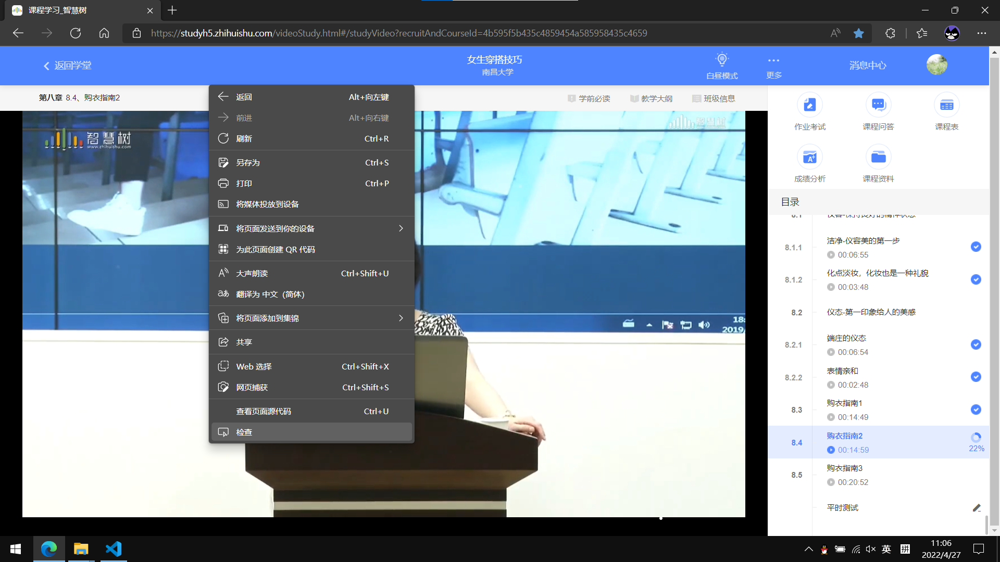
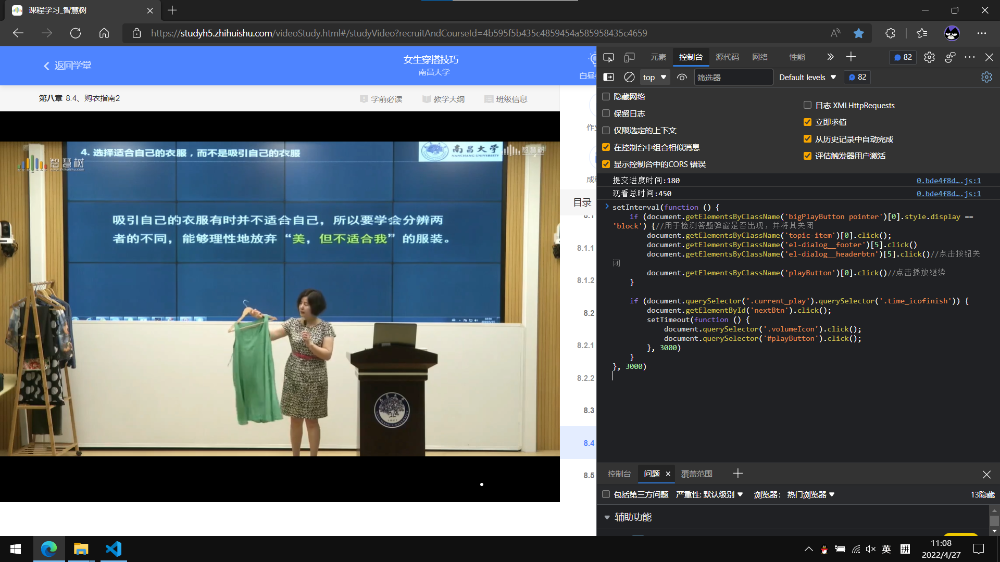

# 智慧树自动刷课脚本

## 代码
```js
setInterval(function () {
    if (document.getElementsByClassName('bigPlayButton pointer')[0].style.display == 'block') {//用于检测答题弹窗是否出现，并将其关闭
        document.getElementsByClassName('topic-item')[0].click();
        document.getElementsByClassName('el-dialog__footer')[5].click()
        document.getElementsByClassName('el-dialog__headerbtn')[5].click()//点击按钮关闭
        document.getElementsByClassName('playButton')[0].click()//点击播放继续
    }

    if (document.querySelector('.current_play').querySelector('.time_icofinish')) {
        document.getElementById('nextBtn').click();
        setTimeout(function () {
            document.querySelector('.volumeIcon').click();
            document.querySelector('#playButton').click();
        }, 3000)
    }
}, 3000)
```

## 功能
* 自动静音
* 当前视频进度100%后 直接跳到下一个视频
* 自动提交视频中的问题

## 使用方法
只能在电脑的主流浏览器(chrome, msedge, firefox, safari等)上使用, 因为需要打开浏览器的开发者工具

以msedge为例, 复制上面的代码, 打开智慧树课程网页, 右键空白区域, 点击`检查`



点击控制台, 将刚才复制的源代码粘贴到光标处, 按下回车,完成



## 其他
* 每次开始刷课都要进行一次复制粘贴, 所以最好把源代码保存下来
* 没有做成浏览器内置插件, 因为不会
* 与其叫自动刷课, 更准确点应该叫自动点击, 因为只是调用了元素的`click()`函数
* 参考文章:[智慧树/知到 一键刷课脚本代码（网页自动版 2020最新版）](https://www.cnblogs.com/2zly/p/13405826.html)
* 我修复了那篇文章中进入下一个视频时不会自动开播的bug, 移除了调整速率的部分, 将当前视频完成度改为 检测当前播放的视频是否存在已完成图标, 
* 好像智慧树的完成度好像是参照观看视频时长的, 1.5速率没有意义
* 不知道是智慧树服务器问题还是其他, 偶尔会弹出网络问题而导致停止课程
